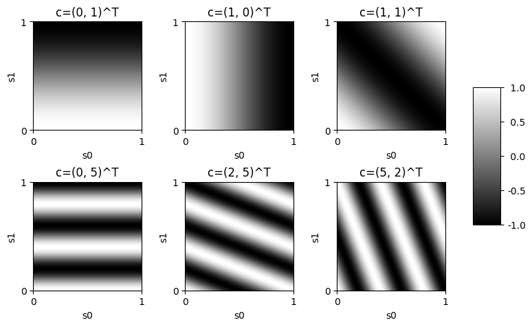

# PyTorch Fourier Basis for Linear Function Approximation

Fourier basis representation as described in [Reinforcement Learning: An Introduction by Richard S. Sutton
and Andrew G. Barto](http://incompleteideas.net/book/the-book.html), **Section 9.5.2 Fourier Basis**.

Represent state $\mathbf{s} \in \mathbb{R}^k$ as feature vector $\mathbf{x} \in \mathbb{R}^{(n + 1)^k}$ using
order- $n$ fourier basis with coefficients $C \in \mathbb{R}^{k \times (n + 1)^k}$

$$
\begin{align*}
\mathbf{s} &= (s_1, s_2, \dots, s_k)^T, \; s_i \in [0, 1] \\
\mathbf{c}^i &= (c_1^i, c_2^i, \dots, c_k^i)^T \\
c_j^i &\in \{0, \dots, k\}, \; j = 1, \dots, k, \; i = 1, \dots, (n + 1)^k \\
x_j(s) &= cos(\pi \mathbf{s}^T \mathbf{c}^j) \\
C &= \left(\mathbf{c}^1, \mathbf{c}^2, \dots, \mathbf{c}^{(n + 1)^k}\right), \; C \in \mathbb{R}^{k \times (n + 1)^k} \\
\mathbf{x} &= cos(i \pi s^T C), \; \mathbf{x} \in \mathbb{R}^{(n + 1)^k} \\
\end{align*}
$$

.

## Example

A state consists of two continous variables, `s0` and `s1` with values in `[0, 1]`.


```python
import torch

D = 256
s = torch.linspace(0.0, 1.0, D)
s0, s1 = torch.stack(torch.meshgrid(s, s, indexing="xy"))
```

A `FourierBasis` is constructed for two features `k=2` (state space) and fourier basis `n=5` and applied to representation of the whole state space.


```python
from fourierbasis import FourierBasis

fb = FourierBasis(2, 5)
x = fb(torch.stack((s0, s1), dim=2).view(-1, 2)).view(D, D, -1)
```

The indices to coefficients matching **Figure 9.4** are determined.


```python
from itertools import product

coeff = list(product(range(5 + 1), repeat=2))
indices = [coeff.index(v) for v in [(0, 1), (1, 0), (1, 1), (0, 5), (2, 5), (5, 2)]]
```

Specific components of the state space represented in fourier basis space (compare with **Figure 9.4**).


```python
from matplotlib import pyplot as plt, rc
from matplotlib.ticker import FixedLocator

rc("image", cmap="gray")
fig, ax = plt.subplots(2, 3, figsize=(8, 4))
ax = ax.flatten()
extent = [0, 1, 1, 0]
locator = FixedLocator([0, 1])
for a, i in zip(ax, indices):
    im = a.imshow(x[..., i], extent=extent)
    a.invert_yaxis()
    a.xaxis.set_major_formatter("{x:.0f}")
    a.xaxis.set_major_locator(locator)
    a.yaxis.set_major_formatter("{x:.0f}")
    a.yaxis.set_major_locator(locator)
    a.set_title(f"c={coeff[i]}^T")
    a.set_xlabel("s0")
    a.set_ylabel("s1")
fig.subplots_adjust(left=0.0, right=0.75, top=1.0, bottom=0.0, wspace=0.4, hspace=0.4)
cbar_ax = fig.add_axes([0.8, 0.25, 0.05, 0.5])
fig.colorbar(im, cax=cbar_ax, format="{x:4.1f}");
```


    

    


## Installation

```
pip install git+https://github.com/tasptz/pytorch-fourierbasis.git
```

